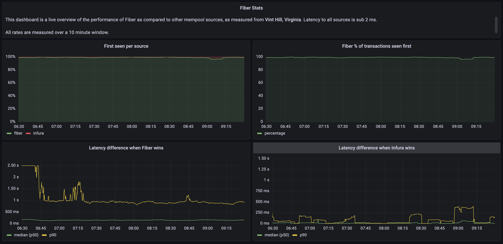

# Fiber Stats Setup

This repo can be used to set up a dashboard to track the performance of Fiber vs. a web3 API (like your local node or Infura / Alchemy).


## Usage
* Get the repo
```bash
git clone https://github.com/chainbound/fiber-stats && cd fiber-stats
```

* Create the .env file from the example
```bash
cp .example.env .env
```

* Set the correct values in the .env file
* Run the Docker Compose setup
```bash
docker compose up --build -d
```

This will start a Grafana server on 0.0.0.0:80. You can change the ports in `docker-compose.yml`.
You can then navigate to the **Fiber Stats** dashboard.

